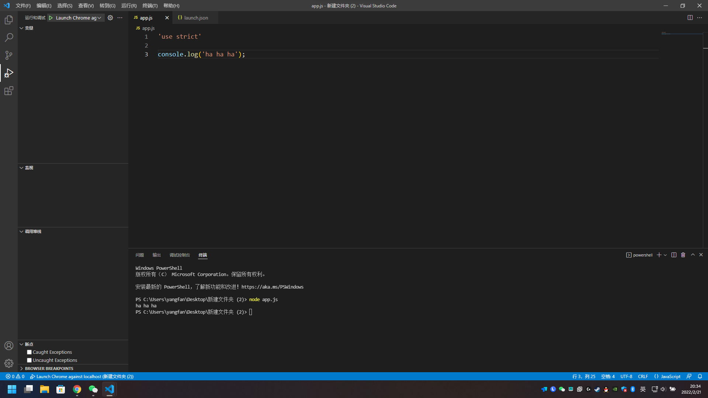

# 初识node.js

# yarn

## 安装
用npm装
```
npm install -g yarn
```

## 初始化一个项目
```
yarn init
```

## 装包
```
yarn add <packagename>
yarn add <packagename> --dev
```

## 更新包
```
yarn upgrade <packagename>
```

## 删除包
```
yarn remove <packagename>
```

## 安装所有包
```
yarn install
```

## 发布包
```
yarn publish
```

## 查看包的缓存列表
```
yarn cache list
```

## 全局安装包
```
yarn global <pagename>
```





