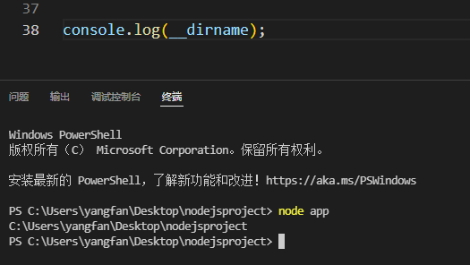
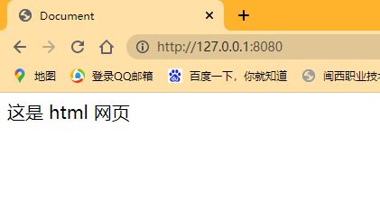
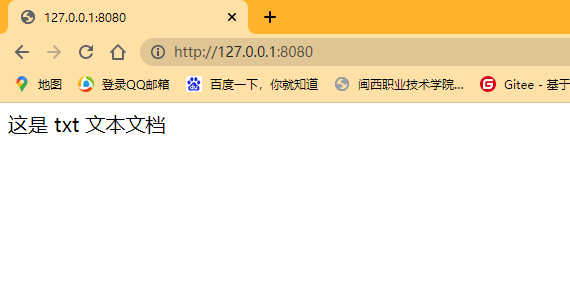

# 文件服务器路径处理

获取文件绝对路径的另一种方法

**__dirname**




# 代码
```
fs.stat(filepath, function (err, stats) {
        if (!err && stats.isFile()) {
            // 如果路径是一个文件
            res.writeHead(200, { 'content-type': 'text/html;charset=utf-8' })
            fs.createReadStream(filepath).pipe(res);
        } else if (stats.isDirectory()) {
            // 如果路径是一个目录
            fs.readdir(filepath, function (err, files) {
                if (!err) {
                    // 目录下有文件
                    let asd = files.filter(item => {
                        return item === 'index.html';
                    })
                    if (asd.length > 0) {
                        // 有 index.html 文件
                        let newfilepath = path.join(filepath, 'index.html');
                        fs.createReadStream(newfilepath).pipe(res);
                    } else {
                        // 没有 index.html 文件，过滤 js 文件后，读取目录下的第一个文件
                        for (let i = 0; i < files.length; i++) {
                            if (files[i].indexOf('.js') > 0) {
                                files.splice(i, 1)
                            }
                            let newfilepath = path.join(filepath, files[0]);
                            res.writeHead(200, { 'content-type': 'text/html;charset=utf-8' })
                            fs.createReadStream(newfilepath).pipe(res);
                        }
                    }
                } else {
                    // 目录下没有文件
                    res.writeHead(404);
                    res.end('<h1>404</h1>');
                }
            })
        } else {
            // 路径不存在
            res.writeHead(404, { 'content-type': 'text/html;charset=utf-8' });
            res.end('<h1>路径不存在，错误！</h1>')
        }
    })
```
# 运行结果
## 有 index.html 文件

## 没有 index.html 文件



