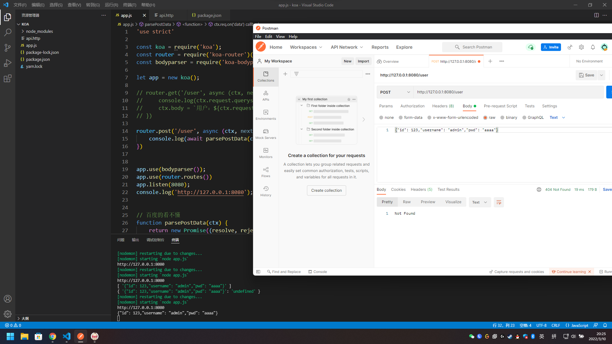
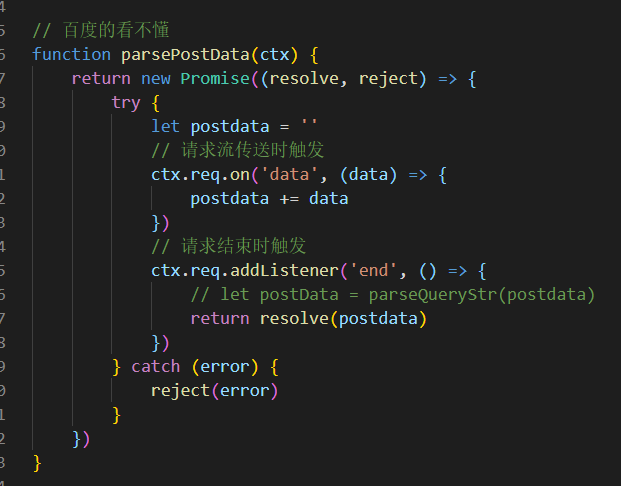

# POST获取请参数

# POST

中间件放在路由系统后面，每一次请求都没有执行解析  
所以 app.use(bodyparser()) 要放在 app.use(router.routes()) 之前  

```
app.use(bodyparser());
app.use(router.routes());
```

  


在 express 中，用req.body可以直接获取 post 的 json 对象