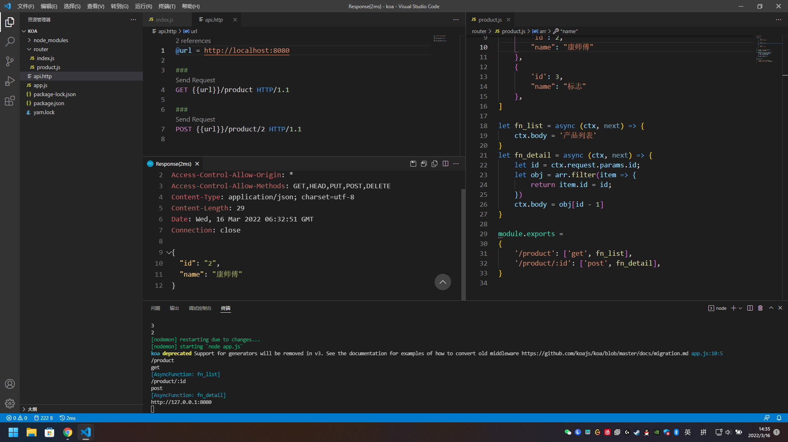
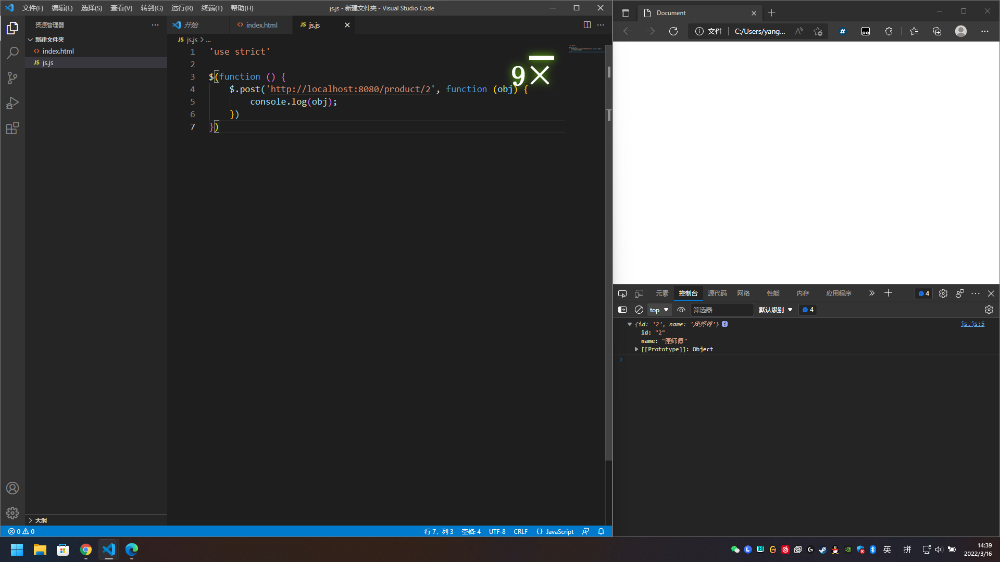

# 跨域访问

# cors 跨域
Ajax 是严格遵守同源策略的，既不能从另一个域读取数据，也不能发送数据到另一个域。但是，W3C 的新标准中 cors（Cross Origin Resource Sharing）推进浏览器支持这样的跨域方案

cors 需要浏览器和服务器同时支持。目前，所有浏览器都支持该功能
## 同源:

+ 协议
+ 域名
+ 端口号

只要以上三个值是相同的，我们就认为这两个资源是同源的


浏览器将 cors 请求分成两类：简单请求（simple request）和非简单请求（not-so-simple request）。  
只要同时满足以下两大条件，就属于简单请求：
```
（1) 请求方法是以下三种方法之一：

    HEAD
    GET
    POST
（2）HTTP的头信息不超出以下几种字段：

    Accept
    Accept-Language
    Content-Language
    Last-Event-ID
    Content-Type：只限于三个值application/x-www-form-urlencoded、multipart/form-data、text/plain
```

非简单请求是那种对服务器有特殊要求的请求，比如请求方法是PUT或DELETE，或者Content-Type字段的类型是application/json

## 1、Post Get


## 跨域
