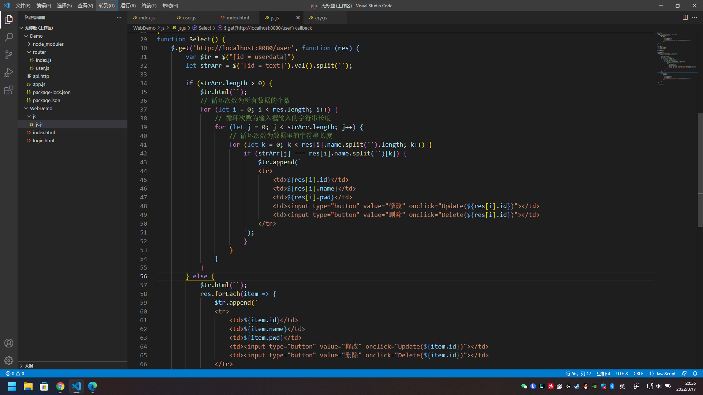
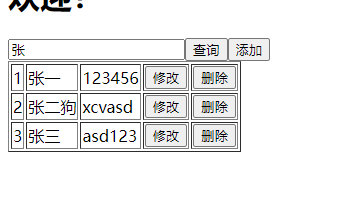
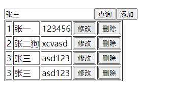

# 前后端分离初体验

## 代码截图
  

## 截图预览
  

BUG 👇  
当输入的关键字和数据里的字符串有多个字重复或关键字和数据里的字符串一模一样时会多次循环打印，就是有重复(这句话读起来怪怪的，但是我想不到别的词了)  
  

# Promise

promise 是一个函数，有两个参数: resolve 和 reject，分别带表异步执行成功的回调函数 resolve 和异步执行失败的回调函数 reject

then 是实例状态发生改变时的回调函数，第一个参数是 resolved 状态的回调函数，第二个参数是 rejected 状态的回调函数
