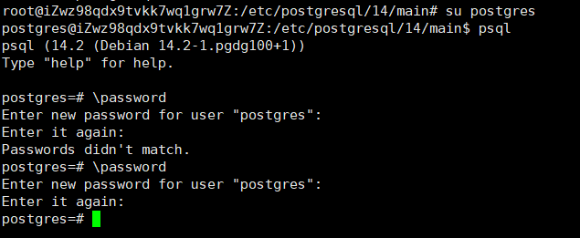

# 连接服务器数据库

## 连接数据库
```
// 引入 sequelize 模块
const { Sequelize } = require('sequelize');

// 创建对象
const sequelize = new Sequelize('database', 'user', 'password', {
    // host: 'localhost',
    host: 'pigfarm.top',
    dialect: 'postgres'
});
```

## postgresql

### postgresql 的安装
```
// 创建文件存储库配置：
sh -c 'echo "deb http://apt.postgresql.org/pub/repos/apt $(lsb_release -cs)-pgdg main" > /etc/apt/sources.list.d/pgdg.list'

// 导入存储库签名密钥：
wget --quiet -O - https://www.postgresql.org/media/keys/ACCC4CF8.asc | sudo apt-key add -

// 更新包列表：
apt-get update

// 安装最新版本的 PostgreSQL。
// 如果你想要一个特定的版本，使用 'postgresql-12' 或类似的而不是 'postgresql':
apt-get -y install postgresql
```

postgresql 配置文件路径在 /etc/postgresql/14/main 里  
psql 是 PostgreSQL 中的一个命令行交互式客户端工具  
postgresql 默认为没有密码,修改密码操作如下：  


```
// 进入到数据库模式
su postgres

// 使用 psql 工具
psql

\password
```

