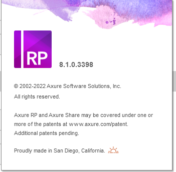
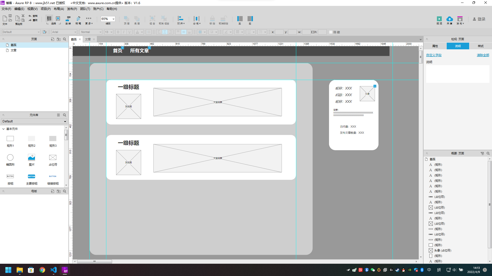
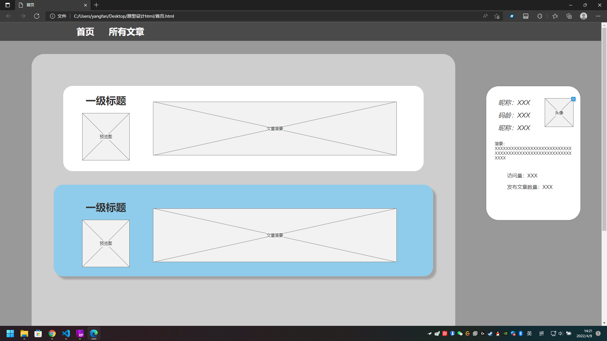
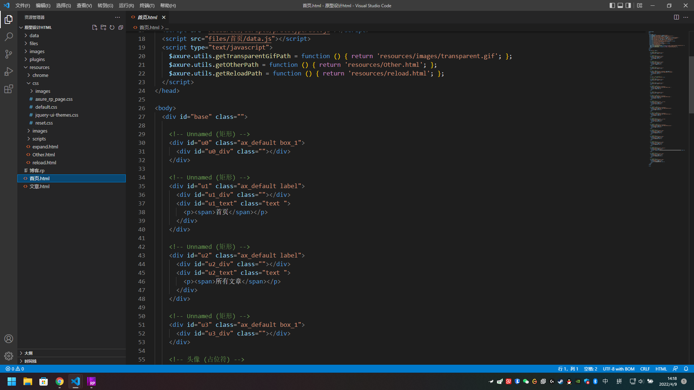

# 原型设计

## Axure

授权(百度的，能用就行)  
Team Edition（团队版）  
Licensee：www.jb51.net  
Key: smn/B4H9oFf30K6sLW36LaTs11yoKk5p616FpnyGdbtTum95cKLanzezWL6EZOOA  
适用于次版本 👇  

## 作业

  
  

导出的 html 文件  
  
很乱，可能是 Axure 里没有给命名

